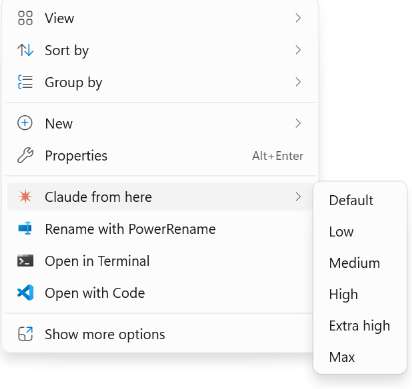
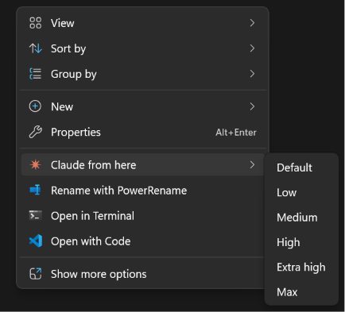

# Claude From Here

Right-click any folder in Windows 11 Explorer and open Claude Code there. One click, no terminal juggling.

## Why

Windows 11 moved the classic right-click context menu behind "Show more options" — so any tool you register the old way is two clicks away, buried. This extension puts "Claude from here" at the top level of the modern context menu, exactly where you want it.

No registry hacks. No admin required. It installs per-user using a sparse MSIX package — the same approach VS Code uses for its Explorer integration. Click the installer, click through the wizard, and it's in your right-click menu.

Works on folder right-click and folder background right-click. Open any project, any directory, instantly in Claude Code.

## Install

Download the latest installer from [Releases](https://github.com/NYBaywatch/claude-from-here/releases):

**[ClaudeFromHere-Setup.exe](https://github.com/NYBaywatch/claude-from-here/releases/latest/download/ClaudeFromHere-Setup.exe)** — no admin required, installs per-user.

Requires Windows 11.

## Features

- **Top-level context menu** — appears in the modern Win 11 menu, not buried under "Show more options"
- **Effort level submenu** — pick the reasoning effort for the session (Low → Max), or **Default** to use your system default
- **Folder and folder background** — right-click on a folder or inside a folder in File Explorer
- **Auto-detects paths** — finds Windows Terminal and Claude Code wherever they're installed
- **Custom icon** — Claude icon appears next to the menu item
- **Settings app** — configure CLI flags (--model, --verbose, --allowedTools) via Start Menu shortcut
- **Per-user install** — no admin required, no elevation prompt
- **Clean uninstall** — removes all registry entries, MSIX registration, and files

## Usage

1. Right-click any folder (or inside any folder) in File Explorer
2. Hover **Claude from here** and pick an effort level (or **Default**)
3. Windows Terminal opens with Claude Code running in that directory

### Effort level

**Claude from here** is a submenu — hover it and choose the reasoning effort level for that Claude Code session:

- **Default** — uses your system default effort. Launches `claude` with no `--effort` flag, so it honors your global setting (`CLAUDE_CODE_EFFORT_LEVEL` / `settings.json`).
- **Low**, **Medium**, **High**, **Extra high**, **Max** — launch that session with `claude --effort <level>`.

Higher effort means more thorough reasoning; lower is faster and cheaper. The choice applies only to that launch — it doesn't change your global setting. It also stacks with whatever flags you've configured in Settings.

### Settings

Find **Claude From Here Settings** in the Start Menu to configure how Claude Code is launched — set a default model, enable verbose output, restrict tools, or pass any other CLI flags.

## Troubleshooting

| Problem | Fix |
|---------|-----|
| "Claude from here" doesn't appear after install | Explorer was not restarted. Re-run the installer or restart Explorer via Task Manager. |
| "Claude not found" error dialog | Install Claude Code from claude.ai. Ensure `claude` works in a new terminal. |
| "Windows Terminal not found" error dialog | Install Windows Terminal from the Microsoft Store. |
| Install seems to do nothing | Windows 10 is not supported. Requires Windows 11. |
| Menu item remains after uninstall | Explorer needs a restart. Log out and back in, or restart Explorer from Task Manager. |

## License

[MIT License](LICENSE)
