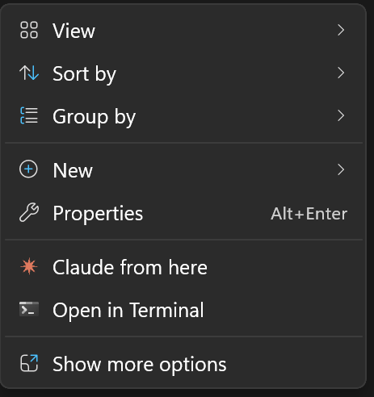

# Claude From Here

Right-click any folder in Windows 11 Explorer and open Claude Code there. One click, no terminal juggling.

## Why

Windows 11 moved the classic right-click context menu behind "Show more options" — so any tool you register the old way is two clicks away, buried. This extension puts "Claude from here" at the top level of the modern context menu, exactly where you want it.

No registry hacks. No admin required. It installs per-user using a sparse MSIX package — the same approach VS Code uses for its Explorer integration. Click the installer, click through the wizard, and it's in your right-click menu.

Works on folder right-click and folder background right-click. Open any project, any directory, instantly in Claude Code.

## Install

Download the latest installer from [Releases](https://github.com/NYBaywatch/claude-from-here/releases):

**[ClaudeFromHere-Setup.exe](https://github.com/NYBaywatch/claude-from-here/releases/latest/download/ClaudeFromHere-Setup.exe)** — no admin required, installs per-user.

Requires Windows 11.

## Features

- **Top-level context menu** — appears in the modern Win 11 menu, not buried under "Show more options"
- **Folder and folder background** — right-click on a folder or inside a folder in File Explorer
- **Auto-detects paths** — finds Windows Terminal and Claude Code wherever they're installed
- **Custom icon** — Claude icon appears next to the menu item
- **Settings app** — configure CLI flags (--model, --verbose, --allowedTools) via Start Menu shortcut
- **Model routing** — add provider profiles (OpenRouter, Kimi, Qwen, a local Anthropic-compatible proxy) and the menu becomes a flyout so you pick per-launch which backend Claude Code talks to
- **Launch profiles** — each profile can pin a reasoning effort, a small/fast model, extra CLI flags, and a Windows Terminal tab color/title so every backend's tab is instantly recognizable
- **Per-user install** — no admin required, no elevation prompt
- **Clean uninstall** — removes all registry entries, MSIX registration, and files

## Usage

1. Right-click any folder (or inside any folder) in File Explorer
2. Click **Claude from here**
3. Windows Terminal opens with Claude Code running in that directory

### Settings

Find **Claude From Here Settings** in the Start Menu to configure how Claude Code is launched — set a default model, enable verbose output, restrict tools, or pass any other CLI flags.

### Routing to other models

On the **Providers** tab of the Settings app, add profiles for alternative backends — presets are included for OpenRouter (Kimi K3, or any of its hundreds of models), Kimi K2 (Moonshot direct), Qwen (DashScope), and a local proxy such as [claude-code-router](https://github.com/musistudio/claude-code-router). OpenRouter speaks the Anthropic protocol natively at `https://openrouter.ai/api`, so no local proxy is needed. Each profile is a name, an Anthropic-compatible base URL, a model name, and an optional API key (stored DPAPI-encrypted, per-user).

Once at least one provider exists, **Claude from here** becomes a flyout: *Claude (default)* plus one entry per provider. Picking a provider launches Claude Code with `ANTHROPIC_BASE_URL`, `ANTHROPIC_AUTH_TOKEN`, and `ANTHROPIC_MODEL` pointed at that backend for that session only. Local servers must expose the Anthropic Messages API (directly or via a proxy like claude-code-router or LiteLLM); leave the API key empty if the server doesn't need one.

### Effort levels

Each provider profile can also pin a reasoning effort (`--effort low/medium/high/xhigh/max`) for its launches. Or enable individual effort levels on the **Other** tab to add just those entries (*Low effort* → *Max effort*) to the flyout without creating profiles — those launch the default backend at that effort for that session only. Effort-level launching was contributed by [Hugo Karlsson](https://github.com/HuggeK) (#4).

## Troubleshooting

| Problem | Fix |
|---------|-----|
| "Claude from here" doesn't appear after install | Explorer was not restarted. Re-run the installer or restart Explorer via Task Manager. |
| "Claude not found" error dialog | Install Claude Code from claude.ai. Ensure `claude` works in a new terminal. |
| "Windows Terminal not found" error dialog | Install Windows Terminal from the Microsoft Store. |
| Install seems to do nothing | Windows 10 is not supported. Requires Windows 11. |
| Menu item remains after uninstall | Explorer needs a restart. Log out and back in, or restart Explorer from Task Manager. |

## License

[MIT License](LICENSE)
